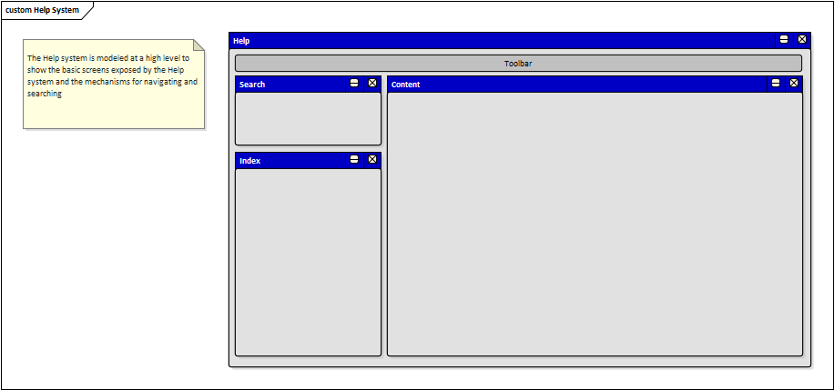

# Documento de Visão do Projeto "TechMusic"

Este documento apresenta uma solução de software para o projeto *"TechMusic"*, 
apresentando os problemas a serem solucionados, as necessidades dos principais envolvidos, o alcance do projeto e as funcionalidades esperadas.

## Objetivos

* Desenvolver um controlador MIDI compatível com softwares de composição de música.

## Problema

* Descrição do problema: Mesas de DJ são caras e pouco customizáveis
* Quem é afetado pelo problema: Pessoas que tem música como hobby
* Impacto no negócio: Entretenimento
* Benefícios de uma boa solução: Reprodução de sons a baixo custo e com allta customização## Definições, 
## Integração com outros sistemas

* Softwares de música (exemplo: ableton).
 
## Interessados

* Músicos não profissionais 1
* DJ's iniciantes 2
* Interressados em música por hobby* etc.

## Usuários

* Tipo de usuário 1
* Tipo de usuário 2
* Tipo de usuário 3
* etc.

## Funcionalidades do produto

* Controlador MIDI 1
* Integração com softwares de música 2
*## Restrições do projeto

* Versão inicial simplificada
* 

## Protótipos

### Não há protótipo 1

Fonte: Exemplos gerados pelo assistente do **Enterprise Architect**.

### Protótipos para funcionalidade 2

Fonte: Exemplos gerados pelo assistente do **Enterprise Architect**.

### Protótipos para funcionalidade N
